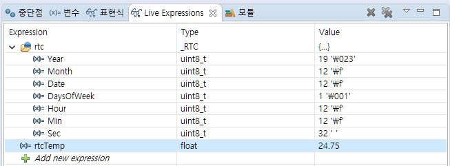

# STM32_HAL_DS3231
DS3231 Library for STM32 HAL

I've implemented DS3231 library for STM32 HAL.
This library doesn't support all of DS3231 features and you may find flaws.

1) RTC Set / Get
2) Temperature / Get
3) Alarm#1 Set / Clear
4) Register Read / Write

https://blog.naver.com/eziya76/221486711330 

 
